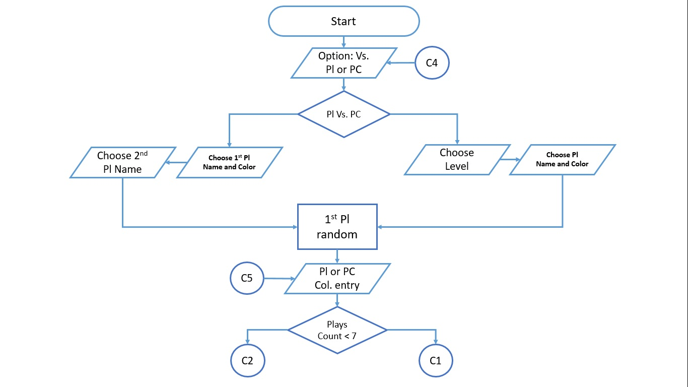
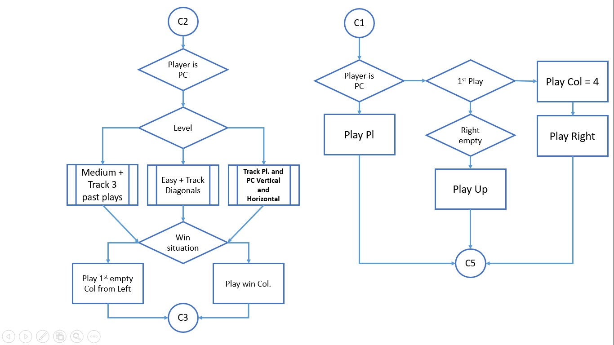
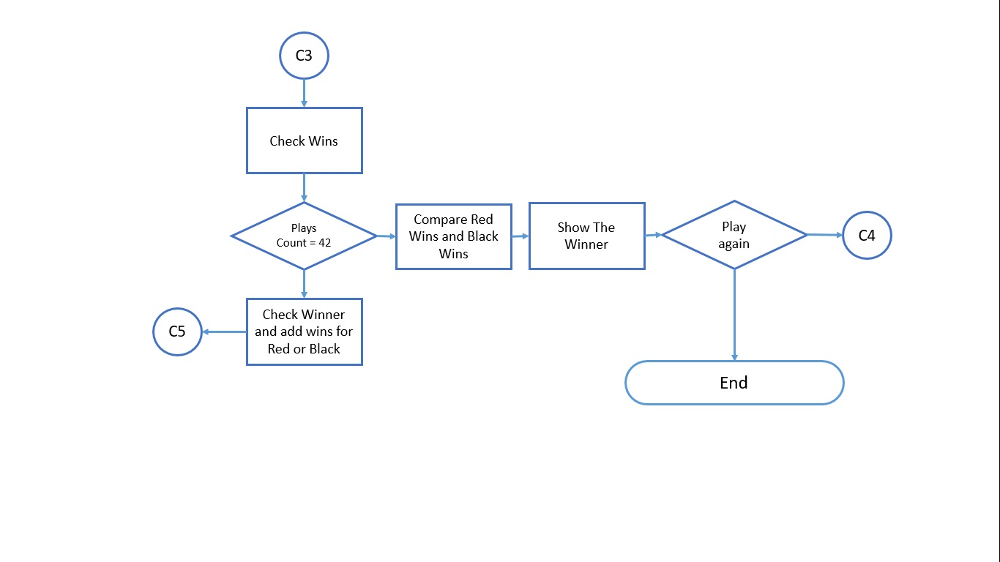

# Connect4Game ACP Course ##(uncompleted Tutorial)

# Connect 4 Game Tutorial

## Table of content

+ [Description](#Description)
+ [Headers](#Headers)
+ [Global](#Global)
    - [Variables](#Variables)
    - [Enumerators](#Enumerators)
+ [Functions](#Functions)
    - [Connect4Game( )](#Connect4Game(-))
    - [InputC4Game( )](#InputC4Game(-))
    - [InputC4GamePC( )](#InputC4GamePC(-))
        * [DownTracking( )](#DownTracking(-))
        * [RightLeftTracking( )](#RightLeftTracking(-))
        * [UpLeft_DownRight_Tracking( )](#UpLeft_DownRight_Tracking(-))
        * [UpRight_DownLeft_Tracking( )](#UpRight_DownLeft_Tracking(-))
    - [printC4Game( )](#printC4Game(-))
    - [winnerC4Game( )](#winnerC4Game(-))
+ [References](#References)
    - [Bugs solved](#Bugs-solved)
    - [Others](#Others)
---

## Description  

 

 

## Headers

#### **here we put the special headers which I needed in my Project**  

`#include <stdlib.h>`  
`#include <iomanip>`  
 for setw  
`#include <windows.h>`    
for Sleep()  
`#include <time.h>`  

`#include <random>`  
`#include <cstring>`  
`#include <algorithm>`  

## Global

### Variables

### Enumerators

## Functions

### Connect4Game( )

### InputC4Game( )

### InputC4GamePC( )

#### DownTracking( )

#### RightLeftTracking( )

#### UpLeft_DownRight_Tracking( )

#### UpRight_DownLeft_Tracking( )

### PrintC4Game( )

### WinnerC4Game( )

## References

### Bugs Solved

### Others
